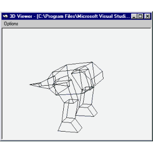



## Model Maker

### Description

This program lets you make your own 3D models and use them in games you are developing. I made this program cos I can't find anything like it elsewhere, and making 3D models in notepad it really hard. I've added a few more bits to it now, including an export and DirectX viewer thing.
 
### More Info
 
You like, draw boxs, and then they go 3D and stuff.

You'll end up with a 3D model, but not in this version, but you will in the next version. It'll export to seperate face format and Direct 3D compatible

             |
---                |---
**Submitted On**   |2000-09-05 13:41:18
**By**             |[N/A](https://github.com/Planet-Source-Code/PSCIndex/blob/master/ByAuthor/empty.md)
**Level**          |Intermediate
**User Rating**    |4.7 (66 globes from 14 users)
**Compatibility**  |VB 6\.0
**Category**       |[Graphics](https://github.com/Planet-Source-Code/PSCIndex/blob/master/ByCategory/graphics__1-46.md)
**World**          |[Visual Basic](https://github.com/Planet-Source-Code/PSCIndex/blob/master/ByWorld/visual-basic.md)
**Archive File**   |[CODE\_UPLOAD9640952000\.zip](https://github.com/Planet-Source-Code/model-maker__1-11186/archive/master.zip)

